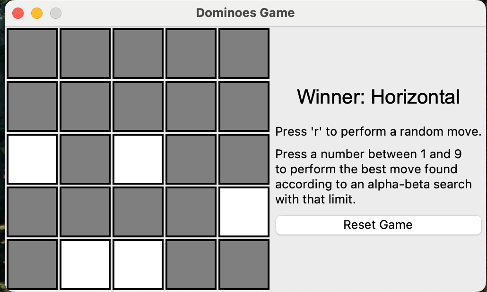

# Blockade Game

## Features
alpha - beta pruning, Minimax algorithm

## Quick Intro
* Minimax with Alpha-Beta Pruning: The AI uses a depth-limited Minimax search with Alpha-Beta pruning to find optimal moves.
* State Evaluation: The evaluation function measures the difference between available moves for the player and opponent.
* Successor Generation: Efficiently generates all possible next states using yield-based iteration.
## How to run
```
 python3 blockade_gui.py row col
```
During gameplay:

* Click on a cell to place a domino (alternates between vertical and horizontal)
* Press 'r' for a random move
* Press numbers 1-9 to make an AI move with that search depth

## Visualization
